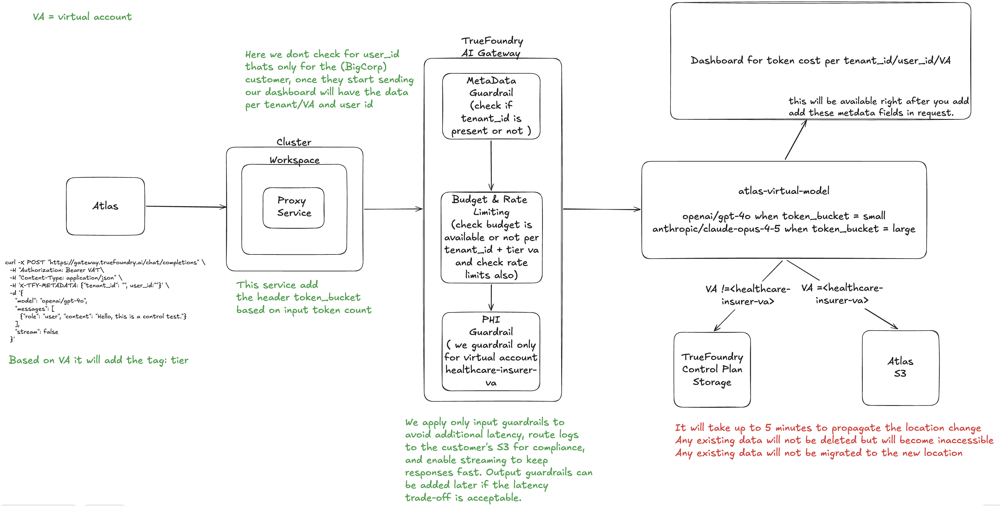

# Atlas multi-tenant AI gateway

Atlas runs a multi-tenant AI assistant for 22 customers on TrueFoundry's AI
Gateway. This repo is the gateway configuration (plus a small FastAPI proxy) that
solves **five** real problems the Atlas team raised: cost runaway, PHI compliance,
data residency, smart model routing, and cost visibility.

Token-based model routing — sending big prompts to Claude and small ones to
GPT-4o — is just **one** of those five pieces (see requirement #4 below). It is a
sub-part of the larger setup, not the whole thing.

## Architecture

---

## Atlas Requirements & How We Solve Them

Every solution below is **config on the TrueFoundry AI Gateway**, not application
code. Requests flow through the gateway carrying metadata (`tenant_id`, `tier`,
`token_bucket`, `user`), and the YAML manifests in this repo act on that metadata.

### 1. CTO — Hard cost ceilings per tenant

> *"One tenant's intern burned $4,200 of OpenAI credit in six hours. The CFO wants
> hard ceilings per customer. We have 22 tenants with very different usage patterns."*

**Solved by:** [`budget-rules.yaml`](manifests/budgets/budget-rules.yaml) (+ tier VAs
[`va-enterprise.yaml`](manifests/virtual-accounts/va-enterprise.yaml), [`va-growth.yaml`](manifests/virtual-accounts/va-growth.yaml),
[`va-starter.yaml`](manifests/virtual-accounts/va-starter.yaml))

A `gateway-budget-config` enforces **per-tenant daily cost limits**, keyed by
`budget_applies_per: metadata.tenant_id`, so each of the 22 tenants gets its own
ceiling rather than a shared pool. Limits are tiered to match different usage
patterns:

| Tier       | Daily limit | Matches on        |
| ---------- | ----------- | ----------------- |
| enterprise | $500/day    | `metadata.tier`   |
| growth     | $100/day    | `metadata.tier`   |
| starter    | $20/day     | `metadata.tier`   |
| untagged   | $10/day     | fallback (catch-all) |

- `audit_mode: false` → limits are **hard-enforced** (requests are blocked at the
  ceiling), not just observed. This is what stops the runaway intern loop.
- Alerts fire to on-call email at **80% / 95% / 100%** before the cap is hit.
- The catch-all `fallback-untagged-daily` rule means a new/untagged tenant can
  never run unbounded.

### 2. CEO — PHI redaction with auditor evidence, for ONE customer only

> *"Our healthcare insurer (22% of ARR) needs SOC 2 proof that PHI doesn't leak into
> OpenAI's logs. None of our other 21 customers care — and the ones who tested
> redaction complained about latency."*

**Solved by:** [`guardrails-policy.yaml`](manifests/guardrails/guardrails-policy.yaml) +
[`phi-guardrail-group.yaml`](manifests/guardrails/phi-guardrail-group.yaml) +
[`healthcare-insurer-va.yaml`](manifests/virtual-accounts/healthcare-insurer-va.yaml)

A `gateway-guardrails-config` applies a PHI-redaction guardrail
(`tfy-pii`, `operation: mutate`, `enforcing_strategy: enforce`, all PII
categories) **scoped to a single subject** — `virtualaccount:healthcare-insurer-va`.
Two design choices map directly to the requirement:

- **Only the healthcare tenant is affected.** The `when.subjects` condition limits
  the policy to that one VA, so the other 21 customers see zero behavior change.
- **Latency is minimized.** `llm_input_guardrails` runs PHI redaction on the way
  *in* (before data reaches OpenAI), while `llm_output_guardrails: []` is left
  empty — we don't double-scan responses, removing the sluggishness the sandbox
  testers complained about.
- **Auditor evidence:** redaction runs as an enforced gateway step, and the
  healthcare VA is tagged `compliance: soc2`, so every redaction is logged and
  attributable for the SOC 2 auditor.

### 3. CISO — No tenant data persisted on vendor infra; logs land in *their* S3

> *"Zero tolerance for prompt/response data — even sanitized — on a vendor's
> infrastructure. Logs land in our S3 with our retention policy, or we don't renew.
> The other 21 are fine with TrueFoundry storage."*

**Solved by:** [`two-va-routing.yaml`](manifests/routing/two-va-routing.yaml)

A `gateway-data-routing-config` splits trace/log storage by tenant:

- Traces created by `virtualaccount:healthcare-insurer-va` route to
  **`storage.type: customer-managed`** — the customer's own S3 bucket
  (`storage_integration_fqn`), with a **90-day retention** policy they control.
  Nothing from this tenant persists on TrueFoundry's control plane.
- The `default` destination stays `controlplane-managed`, so the other 21
  customers are unchanged.

This gives the CISO exactly what he asked for without altering anyone else's setup.

### 4. Head of Product — Token-based model routing, **no service deploy**

> *"Send any input over ~8K tokens to Claude Opus, keep GPT-4o for the rest. The
> deploy queue is four weeks deep — I want this without a service deploy."*

**Solved by:** [`atlas-virtual-model.yaml`](manifests/routing/atlas-virtual-model.yaml) + the proxy
([`main.py`](token-proxy/main.py))

▶️ **Demo video:** https://youtu.be/TpckrfeM_Ww?si=hwCdTnEq4QI7mfT3

The proxy counts input tokens and tags each request with an `x-tfy-metadata`
`token_bucket` of `small` or `large`. The **virtual model** then does
weight-based routing on that metadata, entirely in gateway config:

| token_bucket | Routed to                   |
| ------------ | --------------------------- |
| `small`      | `openai/gpt-4o`             |
| `large`      | `anthropic/claude-opus-4-5` |

- **No four-week deploy:** routing targets live in the virtual model manifest, and
  the cutover threshold is the `SMALL_THRESHOLD` env var (currently `4096`; set to
  `8192` for the ~8K rule). Changing the split is a config change, not an
  application rebuild — the deploy queue never enters the picture.

### 5. Revenue Ops — Per-tenant cost report + per-end-user usage for BigCorp

> *"CFO needs a per-tenant cost report for the last 90 days. BigCorp wants
> per-end-user usage inside their org. Today we have zero visibility at either level."*

**Solved by:** per-request metadata + [`bigcorp-va.yaml`](manifests/virtual-accounts/bigcorp-va.yaml)

Because every request carries `metadata.tenant_id` (the same key the budgets use)
and a per-user identifier, the gateway's usage/cost metrics can be grouped at two
levels:

- **Per-tenant cost (90 days):** aggregate gateway cost metrics by
  `metadata.tenant_id` — this directly produces the CFO's chargeback report and
  exposes the two outlier tenants billing flat per-seat.
- **Per-end-user for BigCorp:** [`bigcorp-va.yaml`](manifests/virtual-accounts/bigcorp-va.yaml) is BigCorp's
  dedicated virtual account (tagged `tier: enterprise`); filtering its traffic by
  the `user` metadata dimension surfaces power users inside their org.

---

## Manifest index

| File | Purpose |
| ---- | ------- |
| [`service.yaml`](token-proxy/service.yaml) / [`deploy.py`](token-proxy/deploy.py) | Deploy the proxy service |
| [`atlas-virtual-model.yaml`](manifests/routing/atlas-virtual-model.yaml) | Token-based model routing (req #4) |
| [`budget-rules.yaml`](manifests/budgets/budget-rules.yaml) | Per-tenant cost ceilings (req #1) |
| [`guardrails-policy.yaml`](manifests/guardrails/guardrails-policy.yaml) / [`phi-guardrail-group.yaml`](manifests/guardrails/phi-guardrail-group.yaml) | PHI redaction for one tenant (req #2) |
| [`two-va-routing.yaml`](manifests/routing/two-va-routing.yaml) | Customer-managed log storage (req #3) |
| [`va-enterprise.yaml`](manifests/virtual-accounts/va-enterprise.yaml) / [`va-growth.yaml`](manifests/virtual-accounts/va-growth.yaml) / [`va-starter.yaml`](manifests/virtual-accounts/va-starter.yaml) | Tiered virtual accounts |
| [`healthcare-insurer-va.yaml`](manifests/virtual-accounts/healthcare-insurer-va.yaml) / [`bigcorp-va.yaml`](manifests/virtual-accounts/bigcorp-va.yaml) | Customer-specific virtual accounts |
| [`atlas-cluster.yaml`](manifests/cluster/atlas-cluster.yaml) | EKS cluster config |
